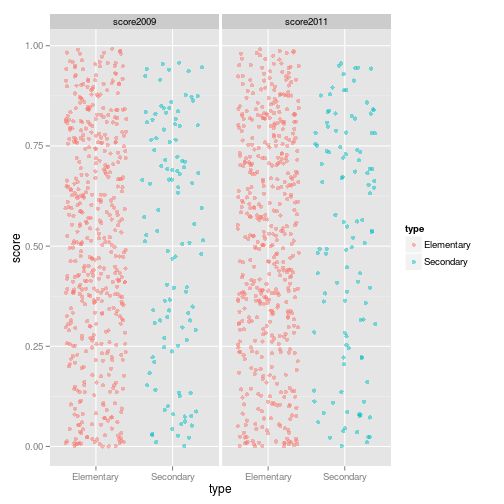
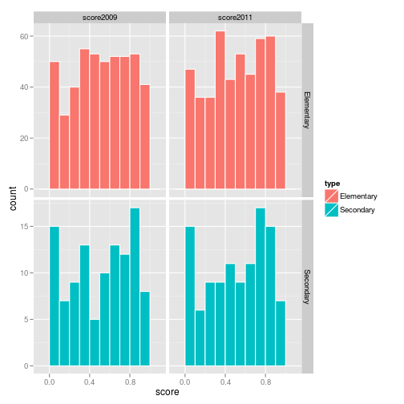
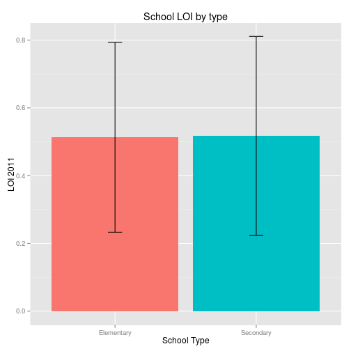
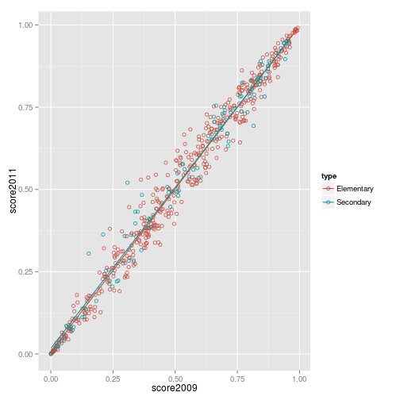
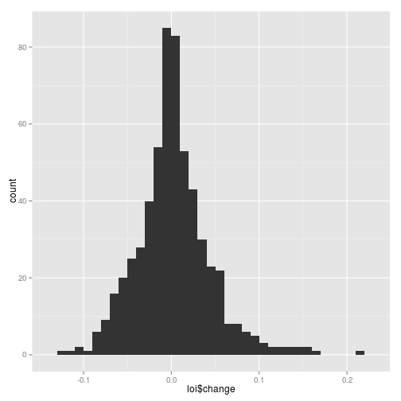
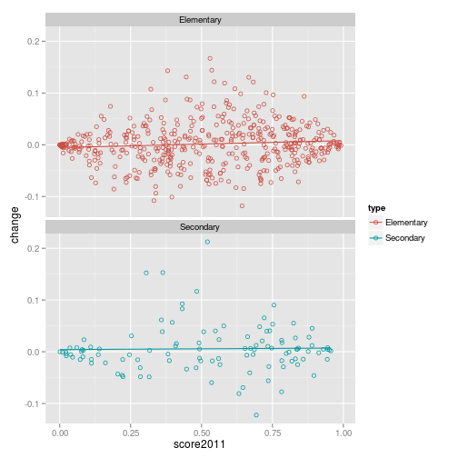
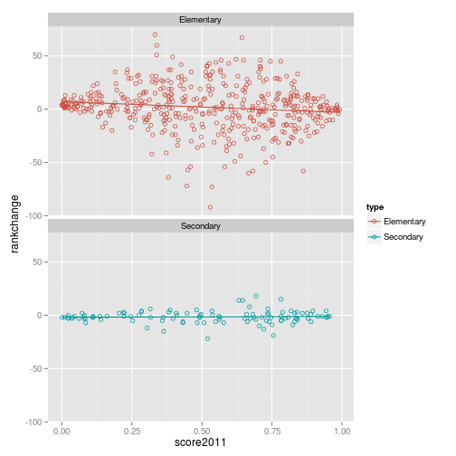
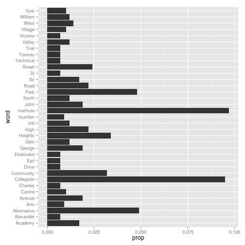
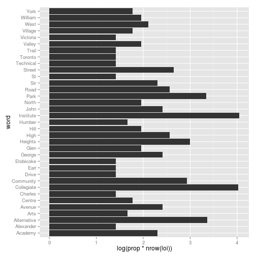
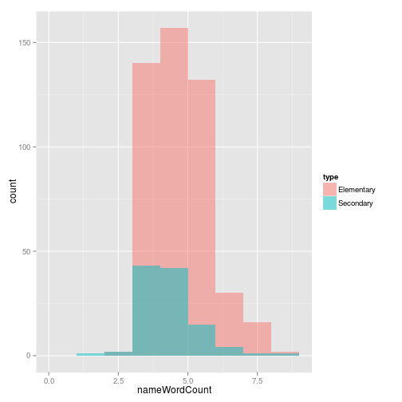

Analyzing Learning Opportunities Index dataset from TDSB
========================================================

```
Author: Bodong Chen
Date: Feb 20, 2013
```

Every two years since 2009, the Toronto District School Board releases the Learning Opportunities Index (LOI), an index that ranks public schools based on a range of indicators that measure external challenges affecting student success. According to [TDSB](http://www.tdsb.on.ca/about_us/media_room/Room.asp?show=OtherNews&view=detailed&enableNav=true&self=17985), one goal of releasing this index is to ensure that children who have access to fewer resources at home and in their neighbourhoods will get a more equitable chance to succeed in their schools. In [the most recent report](http://www.tdsb.on.ca/_site/ViewItem.asp?siteid=172&menuid=30120&pageid=25791) published in 2011, TDSB released LOI scores and ranks of all elementary and secondary public schools from both 2009 and 2011. This dataset, regardless of its simple structure, appears to be an interesting dataset to play with for learning [R](http://www.r-project.org/). 

(Disclaimer: This blog post is not to prove anything or to test any hypothesis. Rather, it represents my personal attempt to access and make sense of publicly available data.)

Retrieve and Clean Dataset
----------

It didn't take long to convert the tables from [the PDF report](http://www.tdsb.on.ca/_site/ViewItem.asp?siteid=172&menuid=30120&pageid=25791) to a clean CSV format since the data is already nicely formatted in the report. (But it will be even nicer if the school board could consider releasing such dataset in more accessible formats in the future in the spirit of "open data".)

So now I can load the dataset into R for analysis.


```r
library(ggplot2)
library(plyr)
library(reshape2)
library(psych)

# read data
loi <- read.csv("data/loi.csv", stringsAsFactors = FALSE)
loi$type <- factor(loi$type, levels = c(1, 2), labels = c("Elementary", "Secondary"))
```


The structure of the dataset:

```r
# structure of dataset
str(loi)
```

```
## 'data.frame':	588 obs. of  7 variables:
##  $ id       : int  194 1355 247 1260 1391 1382 126 1403 100 296 ...
##  $ name     : chr  "Maple Leaf Public School" "Lord Dufferin Junior and Senior Public School" "Shoreham Public School" "Willow Park Junior Public School" ...
##  $ type     : Factor w/ 2 levels "Elementary","Secondary": 1 1 1 1 1 1 1 1 1 1 ...
##  $ score2011: num  0.992 0.987 0.987 0.984 0.982 ...
##  $ rank2011 : int  1 2 3 4 5 6 7 8 9 10 ...
##  $ score2009: num  0.993 0.983 0.986 0.983 0.987 ...
##  $ rank2009 : int  1 6 4 5 3 2 7 8 9 20 ...
```


Exploratory Analysis
---------------------

### A quick look at LOI

LOI scores of schools in 2009 and 2011 are the core data that are of interest in the dataset. So first I am going to check their distributions by doing some quick visualizations.


```r
# melt data to long format, for easier visualization
loi_long <- melt(data = loi, id.vars = c("id", "name", "type"), measure.vars = c("score2009", 
    "score2011"), variable.name = "year", value.name = "score")

# jitter plots of LOI, by year and school type
ggplot(loi_long, aes(x = type, y = score)) + geom_jitter(alpha = I(1/2), aes(color = type)) + 
    facet_wrap(~year, ncol = 2)
```

 

```r

# histograms of LOI, by year and school type
ggplot(loi_long, aes(x = score, fill = type)) + geom_histogram(binwidth = 0.1, 
    colour = "white") + facet_grid(type ~ year, scales = "free_y")
```

 


Overall, LOI scores of schools are distributed quite evenly from 0 to 1, for both elementary and secondary schools. But the high portion of schools with LOI below 0.1 strikes me a little bit.

Then I checked whether average LOI scores of elementary and secondary schools are different.


```r
# check difference between school types
summary <- ddply(loi, .(type), summarise, mean = mean(score2011), sd = sd(score2011))
ggplot(summary, aes(x = type, y = mean, fill = type)) + geom_bar(stat = "identity") + 
    geom_errorbar(aes(ymin = mean - sd, ymax = mean + sd), width = 0.1) + xlab("School Type") + 
    ylab("LOI 2011") + ggtitle("School LOI by type") + guides(fill = FALSE)
```

 


Not surprisingly, the answer is no.

### Change of LOI from 2009 to 2011

LOI score for a school is not very likely to change within two years. So it's very likely score2009 is highly correlated with score2011.


```r
# correlations
cor.test(~score2009 + score2011, loi)
```

```
## 
## 	Pearson's product-moment correlation
## 
## data:  score2009 and score2011 
## t = 159.9, df = 582, p-value < 2.2e-16
## alternative hypothesis: true correlation is not equal to 0 
## 95 percent confidence interval:
##  0.9868 0.9905 
## sample estimates:
##    cor 
## 0.9888
```

```r

# scatterplots of score2009 and score2011 with separate regression lines
# for elementary and secondary
ggplot(loi, aes(x = score2009, y = score2011, color = type)) + geom_point(shape = 1) + 
    scale_colour_hue(l = 50) + geom_smooth(method = lm, se = FALSE)
```

 


The answer is yes, score2009 is significantly correlated with score2011, for both elementary and secondary schools. But it's very interesting that at both ends of the regression lines, schools seem to stand still at where they are, while there is more vibration in the middle ground.

Let's take a closer look at the change of LOI scores.


```r
# compute change of LOI
loi$change <- loi$score2011 - loi$score2009
# summary
round(t(psych::describe(loi$change)), 1)
```

```
##           [,1]
## var        1.0
## n        584.0
## mean       0.0
## sd         0.0
## median     0.0
## trimmed    0.0
## mad        0.0
## min       -0.1
## max        0.2
## range      0.3
## skew       0.7
## kurtosis   2.1
## se         0.0
```

```r

# plot it
qplot(loi$change, binwidth = 0.01)
```

 


It appears that the change of LOI from 2009 to 2011 is close to normal distribution. At the same time, I notice there is outlier(s) whose LOI score(s) increased for more than 0.2 from 2009 to 2011. That's a quite remarkable growth.


```r
# school(s) that deserve applause
loi$name[na.omit(loi$change) > 0.2]
```

```
## [1] "East York Collegiate Institute"
```


Coming back to the interesting phenomenon that schools at both ends tend to stick to their original place, let's plot change of LOI with score2011.


```r
# plot LOI change with score2011, respectively for elementary and
# secondary
ggplot(loi, aes(x = score2011, y = change, color = type)) + geom_point(shape = 1) + 
    scale_colour_hue(l = 50) + facet_wrap(~type, ncol = 1) + geom_smooth(method = lm, 
    se = FALSE)
```

 


In this plot, this phenomenon is even more evident. I may need to dig into the methodology of measuring LOI to make sense of this results. But one possible cause is that ceiling effect (not sure I am using this term properly) that limits the direction of change at both ends.

We can do the same thing for school rank change.


```r
# compute rank change
loi$rankchange <- loi$rank2011 - loi$rank2009

# plot rank change
ggplot(loi, aes(x = score2011, y = rankchange, color = type)) + geom_point(shape = 1) + 
    scale_colour_hue(l = 50) + facet_wrap(~type, ncol = 1) + geom_smooth(method = lm, 
    se = FALSE)
```

 


Interestingly the ranks for secondary schools are more stable comparing to elementary schools, although their scores vibrate on the middle ground. Maybe it's simply because the number of secondary schools is smaller than elementary schools and a slight change with LOI for a school is less likely to affect its ranking.

It is also interesting that the regression line for scores of elementary schools is slightly going upwards, while the line for ranks of those schools is slightly going downwards. Although further significance test is needed to make any claim, this may suggest learning opportunities are getting slightly more equitable for elementary schools.

Some Wired Stuff
-----------------

What are common words in TDSB school names? (inspired by [this post](http://jeromyanglim.blogspot.ca/2012/05/example-reproducile-report-using-r.html))


```r
# create a vector of the words that occur in school names
lw <- unlist(strsplit(loi$name, split = " "))

# remove stopwords that are not very informative
stopwords <- c("School", "Public", "Senior", "Junior", "Middle", "Elementary", 
    "Secondary", "and", "of", "for", "the")
lw <- lw[!(lw %in% stopwords)]

# extract words longer than 1, because there are many initials in school
# names loi$name[grep('[A-Z] +', loi$name)]
lw <- lw[nchar(lw) > 1]

# create a table of the frequency of school names
tlw <- table(lw)

# extract cells of table with count greater than 3
tlw2 <- tlw[tlw > 3]

# sorted in decreasing order
tlw2 <- sort(tlw2, decreasing = TRUE)

# values as proporitions
tlw2p <- round(tlw2/nrow(loi), 3)

# show this in a bar graph
tlw2pdf <- data.frame(word = names(tlw2p), prop = as.numeric(tlw2p), stringsAsFactors = FALSE)
tlw2pdf
```

```
##           word  prop
## 1    Institute 0.097
## 2   Collegiate 0.095
## 3  Alternative 0.049
## 4         Park 0.048
## 5      Heights 0.034
## 6    Community 0.032
## 7       Street 0.024
## 8         High 0.022
## 9         Road 0.022
## 10      Avenue 0.019
## 11      George 0.019
## 12        John 0.019
## 13     Academy 0.017
## 14         Sir 0.017
## 15        West 0.014
## 16        Glen 0.012
## 17        Hill 0.012
## 18       North 0.012
## 19      Valley 0.012
## 20     William 0.012
## 21      Centre 0.010
## 22     Village 0.010
## 23        York 0.010
## 24        Arts 0.009
## 25      Humber 0.009
## 26   Alexander 0.007
## 27     Charles 0.007
## 28       Drive 0.007
## 29        Earl 0.007
## 30   Etobicoke 0.007
## 31          St 0.007
## 32   Technical 0.007
## 33     Toronto 0.007
## 34       Trail 0.007
## 35    Victoria 0.007
```

```r

# the following doesn't work when publishing to WordPress because of a bug
# with the 'evaluate' package
ggplot(tlw2pdf, aes(x = word, y = prop)) + geom_bar(stat = "identity") + coord_flip()
```

 

```r

# make it log counts
ggplot(tlw2pdf, aes(word, log(prop * nrow(loi)))) + geom_bar(stat = "identity") + 
    coord_flip()
```

 


It seems a lot of school names are related to locations, like park, street, valley, heights, etc, and many schools are affiliated with academic institutions, reflected by words like institute, collegiate, academy, arts, etc.

Is the number of words in the school name related to LOI scores and LOI change?


```r
# compute word count of names
loi$nameWordCount <- sapply(strsplit(loi$name, " "), length)
# histogram
ggplot(loi, aes(x = nameWordCount, fill = type)) + geom_histogram(binwidth = 1, 
    alpha = 0.5, position = "identity")
```

 

```r

# correlations
loi_cor <- loi[, c(4, 6, 8, 10)]  # get relevant columns
# correlation test
corr.test(na.omit(loi_cor))
```

```
## Call:corr.test(x = na.omit(loi_cor))
## Correlation matrix 
##               score2011 score2009 change nameWordCount
## score2011          1.00      0.99   0.08         -0.04
## score2009          0.99      1.00  -0.07         -0.02
## change             0.08     -0.07   1.00         -0.14
## nameWordCount     -0.04     -0.02  -0.14          1.00
## Sample Size 
##               score2011 score2009 change nameWordCount
## score2011           584       584    584           584
## score2009           584       584    584           584
## change              584       584    584           584
## nameWordCount       584       584    584           584
## Probability values (Entries above the diagonal are adjusted for multiple tests.) 
##               score2011 score2009 change nameWordCount
## score2011          0.00      0.00   0.27          0.64
## score2009          0.00      0.00   0.27          0.64
## change             0.07      0.07   0.00          0.00
## nameWordCount      0.32      0.63   0.00          0.00
```

```r

# correlation between LOI change and word count of school names
corr <- cor.test(loi$change, loi$nameWordCount, use = "pairwise.complete.obs")
```


Interestingly, the word count of school names is significantly correlated with change of LOI from 2009 to 2011, *r* = -0.14, *p* = 0.001. The longer the school name is, the less likely its LOI increases from 2009 to 2011. I believe it's just a funny coincidence. :)

Are schools with nice seemingly affiliated with academic institutions doing better academically?


```r
# relevant words
academynames <- c("Institute", "Collegiate", "Academy")

# find out for each school name whether it contains any of those words
schsplit <- strsplit(loi$name, " ")
loi$hasAcademy <- sapply(schsplit, function(X) length(intersect(X, academynames)) > 
    0)

# t test
t_test <- t.test(loi$score2011 ~ loi$hasAcademy)
t_test
```

```
## 
## 	Welch Two Sample t-test
## 
## data:  loi$score2011 by loi$hasAcademy 
## t = 0.4866, df = 86.21, p-value = 0.6278
## alternative hypothesis: true difference in means is not equal to 0 
## 95 percent confidence interval:
##  -0.05398  0.08897 
## sample estimates:
## mean in group FALSE  mean in group TRUE 
##              0.5161              0.4986
```


The answer is no, *t*(86) = 0.49, *p* = 0.63.


Further Analysis
--------------------

One analysis I wish to do but don't know how at this moment is to introduce GIS data of each school into this analysis and visualize average LOI score for each region in Toronto. The hard part is to retrieve geotag information for each school. [Calling Google Map API from R](http://statisfaction.wordpress.com/2011/10/05/calling-google-maps-api-from-r/) seems to be a promising direction to follow.

Blogging from R
-----------------

By the way, I am posting this blog directly from R, following [this tutorial](http://yihui.name/knitr/demo/wordpress/) using knitr and RWordPress.
